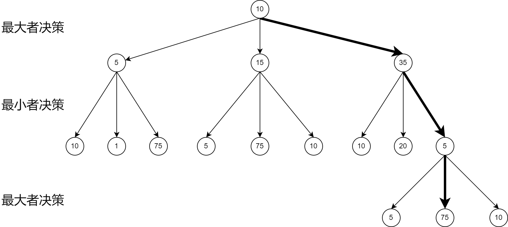

# GoBangAi

GoBangAi是一个使用C++编写的五子棋人工智能，并使用opengl图形库编写了交互界面，它可以和用户对战。使用了极大极小搜索算法和Alpha-Beta剪枝优化，以启发式评估函数来判断棋盘上的局势。

## 实现原理

### board类

board棋盘类负责维护标准的15*15的五子棋棋盘。提供落子接口，并自带合法性检查。同时根据OpenGL库特性，提供可调用的渲染函数，用于对棋盘和棋盘内的落子情况进行渲染，并承接经过处理的用户点击交互。同时，作为五子棋逻辑的最下层单位，
负责提供胜利情况判断，并可以提供胜利动画的绘制。

### AI类

AI类主要分为Ai_JudgeTree和ScoreJudger两个类成员，其中Ai_JudgeTree负责决策树的生成以及剪枝算法的应用，并在决策树遍历的基础上，对给定形式生成最优解。而ScoreJudger类则针对输入棋盘局势，生成单步的局势总判断分数，
该分数由棋盘上所有点的局部分数加权加合得到，可以很好的反映当前局势对于双方的胜负倾向。

### Game类

Game类维护一个棋盘类和一个AI类，并面向用户提供整体渲染和用户点击交互。Game类通过界面分辨率确定棋盘渲染大小，并将渲染棋盘进行定位，以接受用户的点击输入，通过预处理，将点击输入转为合法的Board类落子尝试，并进行尝试落子。
通过AI类成员，在维护交替落子的前提下，Game类根据当前局势，调用AI类生成决策树并遍历得到最优解，将AI的结果落子后，返回给界面继续由用户进行下一次落子。为了便于调试，Game类也可以通过AI类，将决策树的遍历过程，实时的显示在界面中，方便程序员更好的对代码进行debug。

## 极大极小搜索算法

极大极小搜索算法是一种用于决策和博弈论的递归算法，它是一个可以在限定条件下的两个玩家的游戏中，找到最优的决策的算法。这里的限制条件包括：两名玩家轮流进行决策、决策所需的所有信息均是公开透明的、
两名玩家都足够“理智”且“贪心”，会选择对自己最有利的结果。它通过从游戏的终局开始向前推演，计算每个局面的得分，并根据得分选择最佳的走法。
极大极小搜索算法，以自己作为主视角，两位玩家在决策时分别扮演最大化者和最小化者。最大化者试图获得尽可能高的得分，而最小化者试图获得尽可能低的得分。每个局面都有一个与之相关联的值，这个值由一个评估函数计算出来，表示对某个玩家来说到达这个局面有多好。
由于双方轮流决策且在每一步决策中分别对结果进行最大化和最小化，因此我们以下图为例，双方最终会进入如图所示的结局中。

从图片中，我们可以看出，在每一次最大化或是最小化者进行决策时，他们总是倾向与选择当前一步最优的结果，这也是剪枝算法的优化点来源，如当我们在第一步中计算出了35分的得分，那么所有小于35分的情况就无需在递归向下计算了，因为这条路一定不会被选择，下一步轮到最小化决策者决策时，其必然选择更小的结果。
